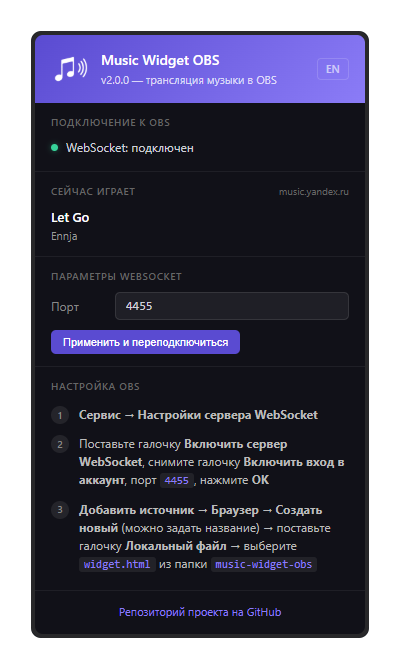
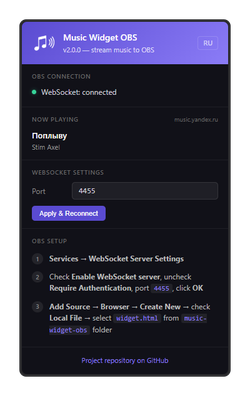
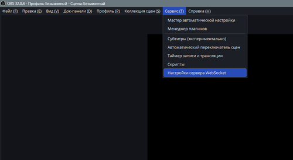
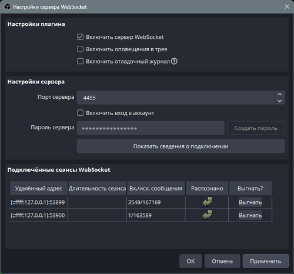

# Music Widget OBS

Виджет для OBS, показывающий текущий трек из браузера.

<p align="center"></p>

## Как это работает

```
Браузер + Extension  →  WebSocket  →  obs-websocket (OBS, порт 4455)  ⇄  WebSocket  →  OBS Виджет
        ↑                                                ↑
mediaSession + DOM slider              Browser Source → widget.html
```

Расширение каждую секунду опрашивает вкладки браузера, забирает данные из Media Session API и тайминг из DOM, и отправляет их через WebSocket в obs-websocket (встроен в OBS Studio). Виджет подключается к тому же WebSocket-серверу и получает данные в реальном времени.

Расширение поддерживает YouTube, Яндекс.Музыку, Spotify, SoundCloud и другие сайты с Media Session API.

<p align="center"> </p>

---

## Установка

Скачайте последний релиз и распакуйте в удобное место:  
[music-widget-obs.zip](https://github.com/Stepanchikkk/music-widget-obs/releases/latest/download/music-widget-obs.zip)

### 1. Расширение для браузера

1. Откройте `chrome://extensions/` (Chrome/Edge) или `opera://extensions/` (Opera)
2. Включите **Режим разработчика** — переключатель в правом верхнем углу
3. Нажмите **Загрузить распакованное** (Load unpacked)
4. Выберите папку `extension/` из архива

### 2. WebSocket сервер в OBS

OBS Studio 28+ имеет встроенный WebSocket сервер:

1. В OBS: **Tools** → **WebSocket Server Settings** (или **Сервис** → **Настройки сервера WebSocket**)
2. Включите **Enable WebSocket server** (Включить сервер WebSocket)
3. **Снимите галочку «Enable authentication» (Включить вход в аккаунт)**
4. Порт **4455** (по умолчанию)

Сервер запускается автоматически вместе с OBS.

<p align="center"> </p>

### 3. Виджет в OBS

1. В OBS создайте источник **Browser Source** (или **Браузер**)
2. Выберите **Local File** (Локальный файл)
3. Укажите путь к файлу `widget.html` из архива
4. Ширина и высота — на ваш вкус (виджет подстраивается автоматически)
5. Поставьте галочку **Transparent** (Прозрачный фон)

<p align="center"></p>

---

## Настройка виджета

### Ориентация

Автоопределение по размеру Browser Source в OBS:

| Условие | Раскладка |
|---------|-----------|
| **Ширина ≥ высота** | Горизонтальная (обложка слева, текст справа) |
| **Высота > ширина** | Вертикальная (обложка сверху, текст снизу) |

Меняйте ориентацию, просто изменяя размеры Browser Source в OBS.

<div align="center">

<p align="center">
  <br>
  <em>Горизонтальная 800×200</em>
</p>

<p align="center">
  <br>
  <em>Горизонтальная широкая 800×150</em>
</p>

<p align="center">
  <br>
  <em>Горизонтальная ультраширокая 1200×150</em>
</p>

<p align="center">
    <br>
  <em>Вертикальная 280×450</em>&emsp;&emsp;&emsp;&emsp;&emsp;&emsp;&emsp;&emsp;&emsp;&emsp;&emsp;<em>Квадратная 400×400</em>&emsp;&emsp;&emsp;&emsp;
</p>

</div>

### Компактный режим

При высоте **≤ 155px** виджет переключается в компактный режим:
- Альбом скрыт
- Тайминг скрыт
- Увеличенные шрифты заголовка и артиста

Удобен для узких полос внизу/вверху экрана.

### Адаптивные цвета

Виджет берёт доминирующие цвета из обложки трека:
- **Фон** — градиент из тёмных тонов обложки
- **Прогресс-бар и акценты** — из светлых тонов

Если обложки нет — фиолетово-голубой дефолт.

---

## Режим разработки

Для тестирования без OBS откройте `widget.html?mock=1` в браузере — покажет демо-данные.

Параметры URL для виджета:
- `?mock=1` — демо-режим
- `?port=xxxx` — нестандартный порт WebSocket
- `?lang=en` — английский язык заглушки

---

## Частые проблемы

| Проблема | Решение |
|----------|---------|
| Виджет пустой / показывает «Нет воспроизведения» | Проверьте, что в OBS включён WebSocket сервер и снята галочка «Включить вход в аккаунт» |
| Расширение не видит музыку | Перезагрузите расширение в `chrome://extensions/`, обновите вкладки с музыкой и нажмите «Обновить» на виджете в OBS |
