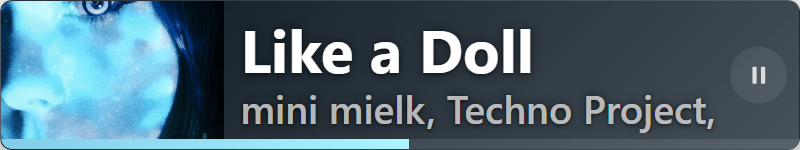
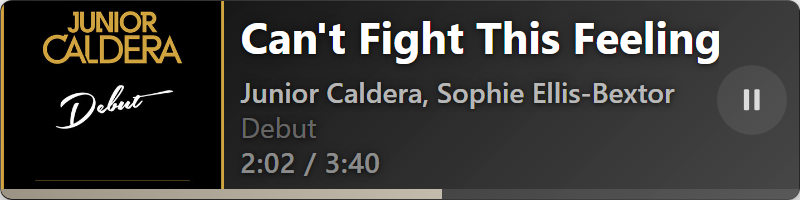
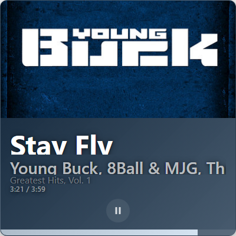
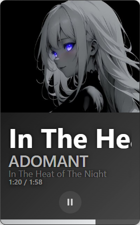

# 🎵 Music Widget для OBS

Виджет для OBS, показывающий текущий трек из браузера (Яндекс.Музыка, Spotify Web, YouTube Music и др.). Работает через Chrome Extension + локальный сервер.

## Как это работает

```
Браузер + Extension  →  POST /api/update  →  Node.js (port 9876)  →  GET /api/track  →  OBS Widget
      ↑                                                     ↑
 mediaSession + DOM slider                            http://127.0.0.1:9876/
```

Расширение каждую секунду опрашивает вкладки, забирает данные из Media Session API и тайминг из DOM. Сервер хранит текущий трек. Виджет в OBS забирает трек с сервера и отображает.

## Быстрый старт

### 1. Установка сервера

```bash
npm install
```

### 2. Запуск сервера

Два варианта — выберите один:

**Вариант А — `launch.vbs` (рекомендуется)**
Двойной клик по `launch.vbs` — сервер запускается **в фоне**, без окна консоли.

**Вариант Б — консоль**
```bash
node server.js
```
Сервер запускается с логом в консоли (удобно для отладки).

### 3. Установка расширения

1. Откройте `chrome://extensions/` (или `edge://extensions/`)
2. Включите **«Режим разработчика»** (переключатель справа вверху)
3. Нажмите **«Загрузить распакованное»**
4. Выберите папку `extension/` из проекта

### 4. Добавление виджета в OBS

1. В OBS создайте источник **«Браузер»** (Browser Source)
2. URL: `http://127.0.0.1:9876/`
3. Размер: минимум **350×90** (горизонтальный), **350×350** (квадрат)
4. Обновляйте источник при необходимости (правый клик → «Обновить»)

### 5. Остановка сервера

Двойной клик по `stop.bat` — сервер останавливается.

## Структура проекта

| Файл | Назначение |
|---|---|
| `server.js` | HTTP сервер (порт 9876), API `/api/track` и `/api/update` |
| `widget.html` | Виджет для OBS (полный, рабочий) |
| `extension/background.js` | Опрос Media Session каждую секунду |
| `extension/manifest.json` | Manifest v3 |
| `extension/popup.html` | Попап расширения (статус, ссылка на виджет) |
| `extension/popup.js` | Логика попапа |
| `extension/icon.png` | Иконка расширения |
| `launch.vbs` | Запуск сервера в фоне (без окна) |
| `stop.bat` | Остановка сервера |
| `screenshots.js` | Генерация скриншотов виджета (dev) |

## Скриншоты

### Горизонтальный

| 800×120 | 700×100 | 300×90 |
|---|---|---|
|  |  |  |

### Квадрат

| 400×400 | 350×350 |
|---|---|
|  |  |

### Вертикальный

| 250×400 | 160×260 |
|---|---|
|  |  |

### Компактный


## Виджет: параметры

### Автоопределение ориентации

`height >= width` → вертикальный (`.v`), иначе горизонтальный (`.h`).

### Компактный режим (≤ 150px высота)

При `height <= 150px` добавляется класс `.compact`:
- Альбом скрыт
- Тайминг скрыт
- Заголовок: `clamp(14px, 55vh, 64px)`
- Артист: `clamp(10px, 45vh, 32px)`

### Адаптивные цвета

Canvas 8×8 → сортировка пикселей по яркости → 10% (тёмный) и 70% (светлый). Если тёмный слишком светлый (>90 яркости) — затемняется до 25%. Фон — градиент от тёмного к чуть светлее. Акцент — из светлого, с бустом контраста (минимум +120 если яркость < 80).

### Тайминг

Реальный из DOM Яндекс.Музыки: `<input type="range" aria-label="Управление таймкодом">`. Сервер передаёт `currentTime`, `duration`, `ts` (timestamp). Виджет корректирует задержку сети: `adjusted = currentTime + (now - ts) / 1000`. Синхронизация каждые 2 сек.

### Минимальные размеры

| Формат | Минимум |
|---|---|
| Горизонтальный | мин. высота **90px** |
| Квадрат | **350×350px** |
| Вертикальный | зависит от высоты |

## API

| Endpoint | Метод | Описание |
|---|---|---|
| `/` | GET | Виджет (HTML) |
| `/api/track` | GET | Текущий трек (JSON) |
| `/api/update` | POST | Обновить трек (JSON) |

### Формат POST /api/update

```json
{
  "title": "Название трека",
  "artist": "Исполнитель",
  "album": "Альбом",
  "thumbnail": "data:image/jpeg;base64,...",
  "state": "playing",
  "currentTime": 138,
  "duration": 282,
  "ts": 1713000000000
}
```

## Разработка

### Генерация скриншотов

```bash
npm install        # если ещё не установлено
node screenshots.js
```

Скриншоты сохраняются в папку `screenshots/`.

### Мок-режим виджета

Добавьте `?mock=1` к URL: `http://127.0.0.1:9876/?mock=1` — виджет покажет демо-трек без запущенного расширения.

## Стратегия

> «Запустил — работает.» Никакого ручного ввода, API токенов, дополнительных действий.
