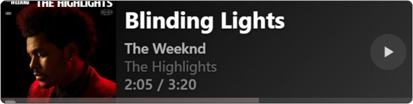
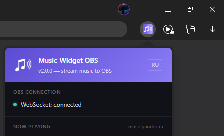
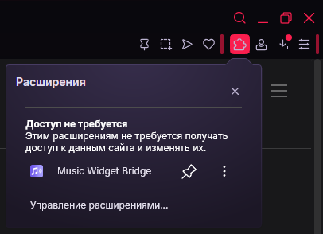
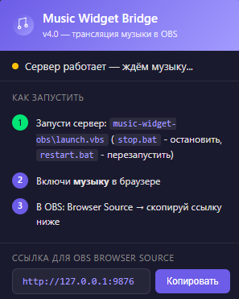
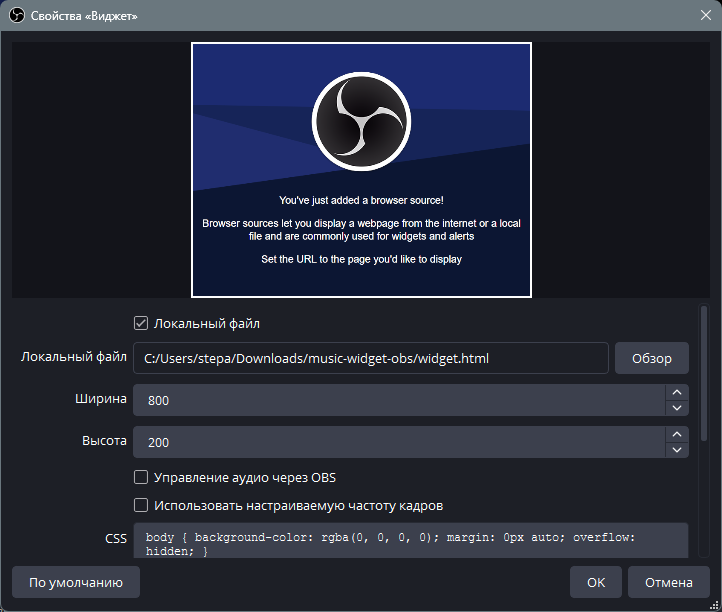

# 🎵 Music Widget для OBS

Виджет для OBS, показывающий текущий трек из браузера.
<p align="center">
  
</p>

## Как это работает

```
Браузер + Extension  →  POST /api/update  →  Node.js (порт 9876)  →  GET /api/track  →  OBS Widget
        ↑                                             ↑
mediaSession + DOM slider                   http://127.0.0.1:9876/
```

Расширение каждую секунду опрашивает вкладки браузера, забирает данные из Media Session API и тайминг из DOM. Сервер хранит текущий трек. Виджет в OBS забирает трек с сервера и отображает.

---

## Установка

### 0. 📥 Скачать архив

1. Перейдите по ссылке:  
   🔗 [📦 Скачать music-widget-obs v4.0 (ZIP)](https://github.com/Stepanchikkk/music-widget-obs/releases/download/4.1/music-widget-obs-v4.1.zip)
2. Распакуйте архив в любом удобном месте
3. Далее работайте внутри этой папки

---

### 1. 🌐 Расширение для браузера

1. Откройте `chrome://extensions/` (Chrome/Edge) или `opera://extensions/` (Opera)
2. Включите **«Режим разработчика»** — переключатель в правом верхнем углу
3. Нажмите **«Загрузить распакованное»** (Load unpacked)
4. Выберите папку `extension/` из распакованного архива

Расширение появится в браузере:

<p align="center">
  
  
</p>

---

### 2. 🖥 Сервер

Для работы нужен **Node.js**. Скачайте и установите с [https://nodejs.org/](https://nodejs.org/) — при установке оставьте все параметры по умолчанию.

**Запуск:**  
В папке проекта лежат `launch.vbs`, `stop.bat` и `restart.bat`:

| Файл | Действие |
|------|----------|
| `launch.vbs` | Двойной клик — сервер запустится **в фоне** без окна консоли |
| `stop.bat` | Остановить сервер |
| `restart.bat` | Перезапустить сервер |

После запуска сервера в расширении изменится статус:

<p align="center">
  
</p>

---

### 3. 🎬 Виджет в OBS

1. В OBS создай источник **«Браузер»** (Browser Source)
2. URL: `http://127.0.0.1:9876/`  
   *(Ссылку на виджет можно всегда скопировать из расширения в браузере)*
3. Размер: виджет подстраивается под заданные размеры, имеет горизонтальную и вертикальную ориентации. При высоте меньше 155px переключается в компактный режим

<p align="center">
  
</p>

---

## Настройка виджета

### ↔️ Ориентация

Автоопределение по размеру Browser Source в OBS:

| Условие | Раскладка |
|---------|-----------|
| **Ширина ≥ высота** | Горизонтальная (обложка слева, текст справа) |
| **Высота > ширина** | Вертикальная (обложка сверху, текст снизу) |

Меняй ориентацию, просто изменяя размеры Browser Source в OBS.

### 🗜 Компактный режим

При высоте **≤ 155px** виджет переключается в компактный режим:
- Альбом скрыт
- Тайминг скрыт
- Увеличенные шрифты заголовка и артиста

Удобен для узких полос внизу/вверху экрана.

### 🎨 Адаптивные цвета

Виджет берёт доминирующие цвета из обложки трека:
- **Фон** — градиент из тёмных тонов обложки
- **Прогресс-бар и акценты** — из светлых тонов

Если обложки нет — фиолетово-голубой дефолт.

---

## 🛠 Частые проблемы

| Проблема | Решение |
|----------|---------|
| Виджет пустой / не обновляется | Проверь, что расширение установлено и иконка 🎵 активна; открой `http://127.0.0.1:9876/api/track` — должен быть JSON |
| Порт 9876 занят | Запусти `stop.bat`, затем `restart.bat`; или измени порт в `server.js` и в URL виджета |
| Расширение не видит вкладки | В `chrome://extensions/` → «Детали» у расширения → включи «Разрешить доступ к файлам» и «Разрешить в режиме инкогнито» (если нужно) |
| Нет обложки / цветов | Некоторые сервисы не отдают обложку через Media Session API — это ограничение браузера, а не виджета |
| Белый фон вместо прозрачного | В свойствах Browser Source в OBS поставь галочку ✅ «Прозрачный фон» (Transparent) |
